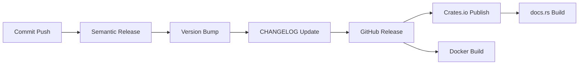

# Crates.io Setup Guide

Bu dosya, Crates.io'ya otomatik publish için gerekli ayarları açıklar.

## 1. Crates.io Token Oluşturma

1. [Crates.io](https://crates.io/) hesabına giriş yap
2. Account Settings → [API Tokens](https://crates.io/settings/tokens)
3. "New Token" butonuna tıkla
4. Token bilgileri:
   - **Name**: `GitHub Actions - soketi-rs`
   - **Scopes**: `publish-update` (veya `publish-new` ilk kez için)
5. Token'ı kopyala (bir daha gösterilmeyecek!)

## 2. GitHub Secrets Ekleme

1. GitHub repository'ye git: https://github.com/ferdiunal/soketi.rs
2. Settings → Secrets and variables → Actions
3. "New repository secret" butonuna tıkla
4. Secret ekle:
   - **Name**: `CARGO_CRATES_TOKEN`
   - **Value**: Crates.io'dan kopyaladığın token
5. "Add secret" butonuna tıkla

## 3. Cargo.toml Metadata

Cargo.toml'da gerekli metadata'lar zaten mevcut:

```toml
[package]
name = "soketi-rs"
version = "0.1.0"
edition = "2024"
authors = ["Ferdi ÜNAL <ferdi@ferdiunal.com>"]
description = "High-performance, Pusher-compatible WebSocket server written in Rust"
readme = "README.md"
homepage = "https://github.com/ferdiunal/soketi.rs"
repository = "https://github.com/ferdiunal/soketi.rs"
license = "GPL-3.0"
keywords = ["websocket", "pusher", "realtime", "server", "soketi"]
categories = ["network-programming", "web-programming", "asynchronous"]
```

## 4. Otomatik Publish Workflow

Semantic Release ile otomatik olarak:

1. **Main branch'e commit push edilir**
   ```bash
   git commit -m "feat: add new feature"
   git push origin main
   ```

2. **Semantic Release çalışır**
   - Commit mesajlarını analiz eder
   - Yeni versiyon belirler (0.1.0 → 0.2.0)
   - CHANGELOG.md günceller
   - GitHub Release oluşturur
   - Git tag oluşturur (v0.2.0)

3. **Crates.io Publish çalışır**
   - Cargo.toml'daki versiyonu günceller
   - `cargo publish` çalıştırır
   - Crates.io'ya yükler

4. **Docker Build çalışır**
   - Multi-platform image'lar build eder
   - Docker Hub'a push eder

## 5. Manuel Publish (Gerekirse)

```bash
# Cargo.toml'da versiyonu güncelle
# version = "0.1.0" -> version = "0.2.0"

# Build ve test
cargo build --release
cargo test

# Dry run (test publish)
cargo publish --dry-run

# Publish
cargo publish --token YOUR_TOKEN
```

## 6. Crates.io'da Kontrol

1. [Crates.io - soketi-rs](https://crates.io/crates/soketi-rs)
2. Yeni versiyon görünmeli
3. Documentation otomatik oluşturulur: [docs.rs/soketi-rs](https://docs.rs/soketi-rs)

## 7. Kullanıcılar İçin

Yayınlandıktan sonra kullanıcılar şöyle kullanabilir:

```toml
# Cargo.toml
[dependencies]
soketi-rs = "0.1"
```

veya

```bash
cargo install soketi-rs
```

## Troubleshooting

### "error: failed to publish to registry"
- Token'ın doğru olduğundan emin ol
- Token'ın `publish-update` yetkisi olduğunu kontrol et
- Crate adının benzersiz olduğunu kontrol et

### "error: crate name is already taken"
- Crate adı zaten kullanılıyor
- Cargo.toml'da farklı bir isim seç

### "error: version already published"
- Bu versiyon zaten yayınlanmış
- Cargo.toml'da versiyonu artır

### "error: missing required fields"
- Cargo.toml'da gerekli metadata'ları kontrol et
- `description`, `license`, `repository` zorunlu

## Crates.io Kuralları

### Versiyon Yönetimi
- ✅ Semantic versioning kullan (0.1.0, 1.0.0, vb.)
- ✅ Yayınlanan versiyonlar değiştirilemez
- ✅ Yeni versiyon için yeni publish gerekir

### Crate İsmi
- ✅ Küçük harf ve tire kullan: `soketi-rs`
- ❌ Büyük harf kullanma: `Soketi-RS`
- ❌ Underscore kullanma: `soketi_rs`

### Lisans
- ✅ GPL-3.0 lisansı kullanılıyor
- ✅ LICENSE dosyası mevcut
- ✅ Cargo.toml'da belirtilmiş

### Dokümantasyon
- ✅ README.md mevcut
- ✅ Kod içi dokümantasyon (`///` comments)
- ✅ Otomatik docs.rs'de yayınlanır

## Yayın Süreci



## Notlar

- ✅ Otomatik publish semantic release ile
- ✅ Cargo.toml versiyonu otomatik güncellenir
- ✅ docs.rs otomatik dokümantasyon oluşturur
- ✅ Crates.io badge'leri README'de kullanılabilir
- ✅ Download istatistikleri crates.io'da görünür

## Badge'ler

README'ye eklenebilecek badge'ler:

```markdown
[](https://crates.io/crates/soketi-rs)
[](https://docs.rs/soketi-rs)
[](https://crates.io/crates/soketi-rs)
[](https://github.com/ferdiunal/soketi.rs/blob/main/LICENSE)
```

## Sonraki Adımlar

1. ✅ Crates.io token oluştur
2. ✅ GitHub secret ekle (`CARGO_CRATES_TOKEN`)
3. ✅ Cargo.toml metadata'ları kontrol et
4. ⏳ İlk commit'i conventional format ile yap
5. ⏳ Semantic Release'in çalışmasını izle
6. ⏳ Crates.io'da yayını kontrol et
7. ⏳ docs.rs'de dokümantasyonu kontrol et

Başarılar! 🦀
