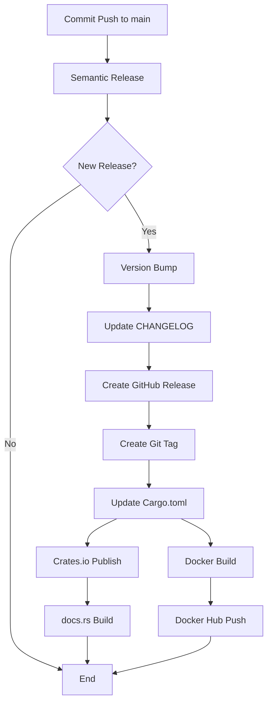

# Complete Release Setup Guide

Bu dosya, Soketi.rs için otomatik release sisteminin tam kurulum kılavuzudur.

## 🎯 Genel Bakış

Semantic Release ile otomatik olarak:
- ✅ Version bump (semantic versioning)
- ✅ CHANGELOG.md güncelleme
- ✅ GitHub Release oluşturma
- ✅ Crates.io'ya publish
- ✅ Docker Hub'a multi-platform image push
- ✅ Documentation (docs.rs) güncelleme

## 📋 Gerekli Token'lar

### 1. GitHub Token
✅ **Otomatik**: `GITHUB_TOKEN` GitHub Actions tarafından sağlanır.

### 2. Docker Hub Token

1. [Docker Hub Personal Access Tokens](https://app.docker.com/settings/personal-access-tokens)
2. "Generate New Token" → `GitHub Actions - soketi-rs`
3. Permissions: `Read, Write, Delete`
4. Token'ı kopyala

**GitHub Secret Ekle:**
- Name: `DOCKER_HUB_TOKEN`
- Value: Docker Hub token'ı

### 3. Crates.io Token

1. [Crates.io API Tokens](https://crates.io/settings/tokens)
2. "New Token" → `GitHub Actions - soketi-rs`
3. Scopes: `publish-update`
4. Token'ı kopyala

**GitHub Secret Ekle:**
- Name: `CARGO_CRATES_TOKEN`
- Value: Crates.io token'ı

## 🔧 Kurulum Adımları

### 1. GitHub Secrets Ekle

```
Repository → Settings → Secrets and variables → Actions
```

Eklenecek secret'lar:
- ✅ `DOCKER_HUB_TOKEN` - Docker Hub token
- ✅ `CARGO_CRATES_TOKEN` - Crates.io token
- ✅ `GITHUB_TOKEN` - Otomatik (eklemeye gerek yok)

### 2. Workflow Dosyaları

Zaten mevcut:
- ✅ `.github/workflows/release.yml` - Ana release workflow
- ✅ `.github/workflows/docker-publish.yml` - PR build workflow
- ✅ `.releaserc.json` - Semantic release config

### 3. Conventional Commits

Commit mesajları [Conventional Commits](https://www.conventionalcommits.org/) formatında olmalı:

```bash
feat: add new feature       # Minor release (0.1.0 → 0.2.0)
fix: fix bug               # Patch release (0.1.0 → 0.1.1)
feat!: breaking change     # Major release (0.1.0 → 1.0.0)
docs: update docs          # Patch release
chore: update deps         # No release
```

Detaylar: [COMMIT_CONVENTION.md](.github/COMMIT_CONVENTION.md)

## 🚀 Release Süreci

### Otomatik Release (Önerilen)

1. **Conventional commit ile değişiklik yap:**
   ```bash
   git add .
   git commit -m "feat: add NATS adapter support"
   git push origin main
   ```

2. **Semantic Release otomatik çalışır:**
   - Commit'leri analiz eder
   - Yeni versiyon belirler (0.1.0 → 0.2.0)
   - CHANGELOG.md günceller
   - GitHub Release oluşturur
   - Git tag oluşturur (v0.2.0)
   - Cargo.toml versiyonunu günceller

3. **Crates.io Publish çalışır:**
   - `cargo publish` çalıştırır
   - Crates.io'ya yükler
   - docs.rs otomatik build eder

4. **Docker Build çalışır:**
   - Multi-platform (amd64, arm64) build
   - Docker Hub'a push:
     - `funal/soketi-rs:0.2.0`
     - `funal/soketi-rs:0.2`
     - `funal/soketi-rs:0`
     - `funal/soketi-rs:latest`

### Manuel Release (Gerekirse)

```bash
# Script ile
chmod +x .github/RELEASE.sh
./.github/RELEASE.sh 0.2.0

# Manuel
git tag -a v0.2.0 -m "Release v0.2.0"
git push origin v0.2.0
```

## 📊 Release Workflow



## 🎨 Commit Types ve Version Bump

| Commit Type | Example | Version Change |
|-------------|---------|----------------|
| `feat:` | `feat: add feature` | 0.1.0 → **0.2.0** (Minor) |
| `fix:` | `fix: bug fix` | 0.1.0 → **0.1.1** (Patch) |
| `perf:` | `perf: optimize` | 0.1.0 → **0.1.1** (Patch) |
| `docs:` | `docs: update` | 0.1.0 → **0.1.1** (Patch) |
| `feat!:` | `feat!: breaking` | 0.1.0 → **1.0.0** (Major) |
| `BREAKING CHANGE:` | Footer'da | 0.1.0 → **1.0.0** (Major) |
| `chore:` | `chore: deps` | **No release** |

## 📦 Yayınlanan Platformlar

### 1. GitHub Releases
- URL: https://github.com/ferdiunal/soketi.rs/releases
- Release notes (CHANGELOG'den)
- Source code (zip, tar.gz)
- Git tag

### 2. Crates.io
- URL: https://crates.io/crates/soketi-rs
- Rust package registry
- `cargo install soketi-rs`

### 3. docs.rs
- URL: https://docs.rs/soketi-rs
- Otomatik API dokümantasyonu
- Her release için güncellenir

### 4. Docker Hub
- URL: https://hub.docker.com/r/funal/soketi-rs
- Multi-platform images (amd64, arm64)
- Semantic version tags + latest

## 🔍 Monitoring

### GitHub Actions
```
https://github.com/ferdiunal/soketi.rs/actions
```

Workflow'lar:
- ✅ Release - Ana release workflow
- ✅ Docker Build (PR Only) - PR'larda build test

### Release Durumu

```bash
# Son release'i kontrol et
curl -s https://api.github.com/repos/ferdiunal/soketi.rs/releases/latest | jq .tag_name

# Crates.io versiyonu
curl -s https://crates.io/api/v1/crates/soketi-rs | jq .crate.max_version

# Docker Hub tags
curl -s https://hub.docker.com/v2/repositories/funal/soketi-rs/tags | jq .results[].name
```

## 🐛 Troubleshooting

### Release çalışmadı
- Commit mesajı conventional format'ta mı?
- Main branch'e push edildi mi?
- GitHub Actions enabled mı?

### Crates.io publish başarısız
- `CARGO_CRATES_TOKEN` secret doğru mu?
- Cargo.toml metadata'ları tam mı?
- Versiyon zaten yayınlanmış mı?

### Docker push başarısız
- `DOCKER_HUB_TOKEN` secret doğru mu?
- Token'ın write yetkisi var mı?
- Dockerfile path'i doğru mu?

### Version bump olmadı
- Commit type doğru mu? (`feat:`, `fix:`, vb.)
- `chore:` commit'leri release oluşturmaz
- Breaking change için `!` veya `BREAKING CHANGE:` gerekli

## 📚 Dokümantasyon

- [Commit Convention](.github/COMMIT_CONVENTION.md) - Commit mesaj formatı
- [Versioning Guide](.github/VERSIONING.md) - Semantic versioning
- [Docker Setup](.github/DOCKER_SETUP.md) - Docker Hub kurulumu
- [Crates Setup](.github/CRATES_SETUP.md) - Crates.io kurulumu

## ✅ Checklist

Kurulum tamamlandı mı?

- [ ] Docker Hub token oluşturuldu
- [ ] `DOCKER_HUB_TOKEN` secret eklendi
- [ ] Crates.io token oluşturuldu
- [ ] `CARGO_CRATES_TOKEN` secret eklendi
- [ ] Conventional commits formatı öğrenildi
- [ ] İlk commit yapıldı ve test edildi
- [ ] GitHub Actions workflow'ları çalışıyor
- [ ] Crates.io'da paket görünüyor
- [ ] Docker Hub'da image'lar var
- [ ] docs.rs'de dokümantasyon oluştu

## 🎉 İlk Release

İlk release için:

```bash
# Conventional commit ile feature ekle
git add .
git commit -m "feat: initial release with full Pusher compatibility

- WebSocket server implementation
- Public, private, presence channels
- Multiple backend support
- Docker deployment ready
"

# Push et
git push origin main

# Semantic Release otomatik çalışacak!
```

Sonuç:
- ✅ GitHub Release: v0.1.0
- ✅ Crates.io: soketi-rs 0.1.0
- ✅ Docker Hub: funal/soketi-rs:0.1.0, latest
- ✅ docs.rs: soketi-rs dokümantasyonu

## 🔗 Faydalı Linkler

- [Conventional Commits](https://www.conventionalcommits.org/)
- [Semantic Versioning](https://semver.org/)
- [Semantic Release](https://semantic-release.gitbook.io/)
- [Keep a Changelog](https://keepachangelog.com/)
- [Crates.io Publishing](https://doc.rust-lang.org/cargo/reference/publishing.html)

---

Başarılar! 🚀
