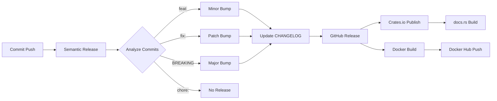

# Semantic Versioning Guide

Soketi.rs, [Semantic Versioning 2.0.0](https://semver.org/) standardını kullanır ve **Semantic Release** ile otomatik versiyonlama yapar.

## 🤖 Otomatik Versioning

Semantic Release, commit mesajlarına göre otomatik olarak versiyon belirler:

| Commit Type | Version Change | Example |
|-------------|----------------|---------|
| `fix:` | **PATCH** | 0.1.0 → 0.1.1 |
| `feat:` | **MINOR** | 0.1.0 → 0.2.0 |
| `feat!:` veya `BREAKING CHANGE:` | **MAJOR** | 0.1.0 → 1.0.0 |
| `docs:`, `style:`, `refactor:`, `perf:`, `test:` | **PATCH** | 0.1.0 → 0.1.1 |
| `chore:`, `ci:`, `build:` | **NO RELEASE** | - |

## 📝 Conventional Commits

Commit mesajları [Conventional Commits](https://www.conventionalcommits.org/) formatında olmalı:

```bash
<type>(<scope>): <subject>

<body>

<footer>
```

### Örnekler

**Patch Release (Bug Fix):**
```bash
git commit -m "fix: resolve WebSocket connection timeout"
# 0.1.0 → 0.1.1
```

**Minor Release (Yeni Özellik):**
```bash
git commit -m "feat: add NATS adapter support"
# 0.1.0 → 0.2.0
```

**Major Release (Breaking Change):**
```bash
git commit -m "feat!: redesign configuration structure

BREAKING CHANGE: Configuration file format has changed.
Old config files need to be migrated.
"
# 0.1.0 → 1.0.0
```

**No Release:**
```bash
git commit -m "chore: update dependencies"
# No version change
```

Detaylı bilgi: [COMMIT_CONVENTION.md](COMMIT_CONVENTION.md)

## 🚀 Release Süreci

### Otomatik Release (Önerilen)

1. **Conventional commit ile değişiklik yap:**
   ```bash
   git add .
   git commit -m "feat: add new feature"
   git push origin main
   ```

2. **Semantic Release otomatik çalışır:**
   - ✅ Commit'leri analiz eder
   - ✅ Yeni versiyon belirler
   - ✅ CHANGELOG.md günceller
   - ✅ GitHub Release oluşturur
   - ✅ Git tag oluşturur (v0.2.0)
   - ✅ Cargo.toml versiyonunu günceller
   - ✅ Crates.io'ya publish eder
   - ✅ Docker Hub'a push eder

3. **Sonuç:**
   - GitHub Release: https://github.com/ferdiunal/soketi.rs/releases
   - Crates.io: https://crates.io/crates/soketi-rs
   - Docker Hub: https://hub.docker.com/r/funal/soketi-rs
   - docs.rs: https://docs.rs/soketi-rs

## 📦 Yayınlanan Platformlar

### 1. GitHub Releases
- Otomatik release notes (CHANGELOG'den)
- Source code (zip, tar.gz)
- Git tag (v0.2.0)

### 2. Crates.io
- Rust package registry
- `cargo install soketi-rs`
- Otomatik docs.rs build

### 3. Docker Hub
- Multi-platform images (amd64, arm64)
- Semantic version tags:
  - `funal/soketi-rs:0.2.0`
  - `funal/soketi-rs:0.2`
  - `funal/soketi-rs:0`
  - `funal/soketi-rs:latest`

## 🔍 Version Kontrolü

```bash
# Son release'i kontrol et
curl -s https://api.github.com/repos/ferdiunal/soketi.rs/releases/latest | jq .tag_name

# Crates.io versiyonu
curl -s https://crates.io/api/v1/crates/soketi-rs | jq .crate.max_version

# Docker Hub tags
curl -s https://hub.docker.com/v2/repositories/funal/soketi-rs/tags | jq .results[].name

# Local git tags
git tag -l
git describe --tags --abbrev=0
```

## 🎯 Release Workflow



## 📊 Version History

Tüm versiyonlar ve değişiklikler:
- **CHANGELOG.md** - Otomatik oluşturulan changelog
- **GitHub Releases** - Release notes ve assets
- **Git Tags** - Versiyon tag'leri

## 🐛 Troubleshooting

### Release oluşmadı
- ✅ Commit mesajı conventional format'ta mı?
- ✅ Main branch'e push edildi mi?
- ✅ Commit type release tetikliyor mu? (`feat:`, `fix:`, vb.)
- ❌ `chore:` commit'leri release oluşturmaz

### Version bump yanlış
- `feat:` → Minor (0.1.0 → 0.2.0)
- `fix:` → Patch (0.1.0 → 0.1.1)
- `feat!:` → Major (0.1.0 → 1.0.0)

### Manuel müdahale gerekirse
```bash
# Sadece acil durumlarda!
# Semantic Release'i bypass etme

# Tag oluştur
git tag -a v0.2.0 -m "Manual release v0.2.0"
git push origin v0.2.0

# Not: Bu Semantic Release workflow'unu tetiklemez
```

## 📚 Kaynaklar

- [Semantic Release](https://semantic-release.gitbook.io/)
- [Conventional Commits](https://www.conventionalcommits.org/)
- [Semantic Versioning](https://semver.org/)
- [Keep a Changelog](https://keepachangelog.com/)

## 💡 Best Practices

1. **Her commit conventional format'ta olmalı**
2. **Küçük, odaklı commit'ler yap**
3. **Breaking change'leri açıkça belirt**
4. **Commit body'de detay ver**
5. **Issue referansları ekle** (`Closes #123`)

## ✅ Checklist

Release öncesi:
- [ ] Tüm testler geçiyor
- [ ] Dokümantasyon güncel
- [ ] Breaking change'ler belgelenmiş
- [ ] Commit mesajları conventional format'ta
- [ ] Main branch güncel

Release sonrası:
- [ ] GitHub Release oluştu
- [ ] Crates.io'da yayınlandı
- [ ] Docker Hub'da image'lar var
- [ ] docs.rs güncellendi
- [ ] CHANGELOG.md güncel
